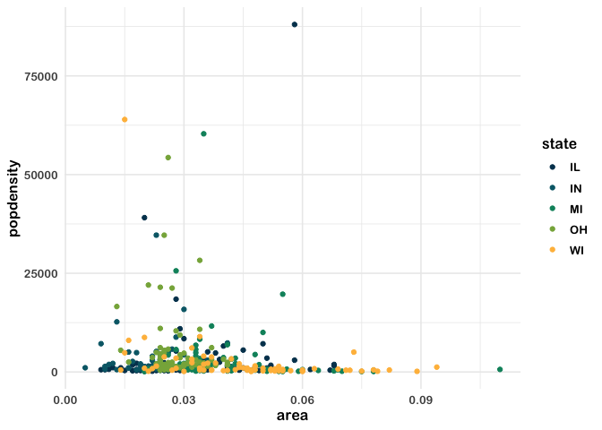

<!-- README.md is generated from README.Rmd. Please edit that file -->

# dataedu 

<!-- badges: start -->

[](https://travis-ci.org/data-edu/dataedu)
[](https://ci.appveyor.com/project/data-edu/dataedu)
[](https://codecov.io/gh/data-edu/dataedu?branch=master)
[](https://cran.r-project.org/)
[](https://github.com/data-edu/dataedu/commits/master)
<!-- badges: end -->

The goal of {dataedu} is to provide readers of [Data Science in
Education Using
R](https://github.com/data-edu/data-science-in-education) with a package
with useful functions, data, and references from the book.

  - [Installation](#installation)
  - [Package Contents](#package-contents)
  - [Contact](#contact)

## Installation

### 1\. Install {devtools}

First, let’s install [{devtools}](https://github.com/r-lib/devtools), an
R package with many handy R tools. In your R console, type in:

``` r
install.packages("devtools")
```

If you already have {devtools} installed, you can move on to the next
step.

If you are not sure whether you have it installed, you can run this
function, which will install {devtools} if you do not already have it.

``` r
if (!require(devtools)) {
  install.packages("devtools")
  library(devtools)
}
```

### 2\. Install {dataedu}

You can install the development version of {dataedu} by running this in
your R Studio console:

``` r
devtools::install_github("data-edu/dataedu")
```

### 3\. Call the package

Before you can use the package, make sure to call it using `library()`:

``` r
library(dataedu)
```

## Package Contents

We created this package to provide our readers an opportunity to jump
into R however they see fit.

1.  Mass installation of all the packages used in the book
2.  Reproducible code for the walkthroughs
3.  Access to the data used in each of the walkthroughs
4.  The dataedu theme and color palette for reuse

### Mass Installation of Packages

We strived to use packages that we use in our daily work when creating
the walkthroughs in the book. Because we covered a variety of subjects,
that means we used a lot of packages\! As described in the Foundational
Skills chapter, you can install the packages individually as they suit
your needs.

However, if you want to get started quickly and download all the
packages at once, please use `install_dataedu()`.

``` r
dataedu::install_dataedu()
```

To see the packages used in the book, run:

``` r
dataedu::dataedu_packages
#>  [1] "apaTables"   "caret"       "dummies"     "ggraph"      "here"       
#>  [6] "janitor"     "lme4"        "lubridate"   "performance" "readxl"     
#> [11] "rtweet"      "randomNames" "sjPlot"      "textdata"    "tidygraph"  
#> [16] "tidylog"     "tidyverse"   "tidytext"
```

**A special note on {tabulizer}:** One of the walkthroughs uses
[tabulizer](https://github.com/ropensci/tabulizer), created by ROpenSci
to read PDFs. {tabulizer} requires the installation of
[RJava](https://cran.r-project.org/web/packages/rJava/index.html), which
can be a tricky process on Mac computers. {tabulizer} is not included in
`mass_install()` and we recommend reading through the notes on its
Github repo if installing.

### Reproducible Code for Walkthroughs

Coming soon\!

### Accessing the Walkthrough Data

You can call the dataset as mentioned in the walkthrough.

``` r
dataedu::course_data
```

### Using the {dataedu} Theme and Palette

Add the theme and palette to ggplot2-based plots using `theme_dataedu()`
and `scale_*_dataedu()`.

``` r
library(ggplot2)
library(dataedu)

ggplot(midwest, aes(x = area, y = popdensity, color = state)) +
  geom_point() +
  theme_dataedu() +
  scale_color_dataedu()
```



## Contact

  - Please report ideas or issues on the [Issues
    page](https://github.com/data-edu/dataedu/issues). If possible, make
    your post reproducible using the
    [{reprex}](https://github.com/tidyverse/reprex) package.
  - Send any pull requests on the [Github
    repository](https://github.com/data-edu/dataedu).
