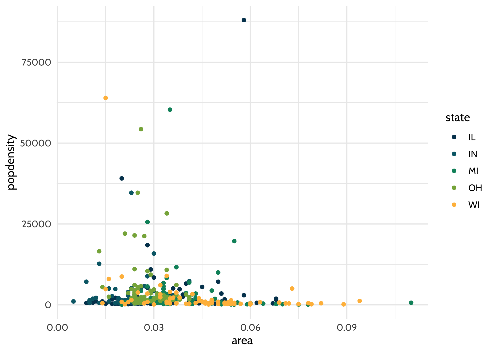

<!-- README.md is generated from README.Rmd. Please edit that file -->

# dataedu 

<!-- badges: start -->

[](https://travis-ci.org/data-edu/dataedu)
[](https://ci.appveyor.com/project/data-edu/dataedu)
[](https://codecov.io/gh/data-edu/dataedu?branch=master)
[](https://cran.r-project.org/)
[](https://github.com/data-edu/dataedu/commits/master)
<!-- badges: end -->

The goal of {dataedu} is to provide readers of [Data Science in
Education Using
R](https://github.com/data-edu/data-science-in-education) with a package
with useful functions, data, and references from the book.

  - [Installation](#installation)
  - [Package Contents](#package-contents)
  - [Contact](#contact)

## Installation

### 1\. Install {devtools}

First, let’s install [{devtools}](https://github.com/r-lib/devtools), an
R package with many handy R tools. In your R console, type in:

``` r
install.packages("devtools")
```

If you already have {devtools} installed, you can move on to the next
step.

If you are not sure whether you have it installed, you can run this
function, which will install the newest version of {devtools} if you do
not already have it.

``` r
if (!require(devtools)) {
  install.packages("devtools")
  library(devtools)
}
```

### 2\. Install {dataedu}

You can install the development version of {dataedu} by running this in
your RStudio console:

``` r
devtools::install_github("data-edu/dataedu")
```

#### Important Notes on Installation

  - {dataedu} requires R 3.6 or above to be installed.

  - {dataedu} has other packages that it needs to be able to run. You
    can see the full list under “Imports” (imported when downloading the
    package) and “Suggests” (we think you should include these too\!) in
    the [DESCRIPTION
    file](https://github.com/data-edu/dataedu/blob/master/DESCRIPTION#L34).

  - **We recommend first checking to see if your packages are all
    up-to-date if you are running into issues with installation.** If
    you have installed the imported/suggested packages previously and
    have not updated them in a while, RStudio may prompt you to update
    them. You can choose to (1) ignore this prompt, (2) exit the prompt
    and update your packages, or (3) try to update your packages through
    the prompt. It’s usually easier to exit and update your packages
    outside the prompt (one way to do this is to go to the RStudio
    Packages pane and click Update, then select the packages you’d like
    to update).

  - In particular, if you have installed {devtools} previously but have
    not updated it in a while, and you try to install the {dataedu}
    package, you may see a messsage such as
    `devtools::install_github("data-edu/dataedu") Error in
    loadNamespace(j <- i[[1L]], c(lib.loc, .libPaths()), versionCheck =
    vI[[j]]) : namespace ‘remotes’ 2.1.0 is being loaded, but >= 2.1.1
    is required.` Please read through the message to see what is needed
    (in this case, updating {remotes}). It’s always best to keep
    {devtools} (and all your packages) up-to-date to limit issues.

### 3\. Call the Package

Before you can use the package, make sure to call it using `library()`:

``` r
library(dataedu)
```

## Package Contents

We created this package to provide our readers an opportunity to jump
into R however they see fit.

1.  [Mass installation of all the packages used in the
    book](#mass-installation-of-packages)
2.  [Reproducible code for the
    walkthroughs](#reproducible-code-for-walkthroughs)
3.  [Access to the data used in each of the
    walkthroughs](#accessing-the-walkthrough-data)
4.  [The dataedu theme and color palette for
    reuse](#using-the-dataedu-theme-and-palette)

### Mass Installation of Packages

We strived to use packages that we use in our daily work when creating
the walkthroughs in the book. Because we covered a variety of subjects,
that means we used a lot of packages\! As described in the Foundational
Skills chapter, you can install the packages individually as they suit
your needs.

However, if you want to get started quickly and download all the
packages at once, please use `install_dataedu()`.

``` r
dataedu::install_dataedu()
```

To see the packages used in the book, run:

``` r
dataedu::dataedu_packages
#>  [1] "apaTables"   "caret"       "dummies"     "ggraph"      "here"       
#>  [6] "janitor"     "lme4"        "lubridate"   "performance" "readxl"     
#> [11] "rtweet"      "randomNames" "sjPlot"      "textdata"    "tidygraph"  
#> [16] "tidylog"     "tidyverse"   "tidytext"
```

**A special note on {tabulizer}:** One of the walkthroughs uses
[tabulizer](https://github.com/ropensci/tabulizer), created by ROpenSci
to read PDFs. {tabulizer} requires the installation of
[RJava](https://cran.r-project.org/web/packages/rJava/index.html), which
can be a tricky process. {tabulizer} is not included in
`install_dataedu()` and we recommend reading through the notes on its
Github repo if installing.

### Reproducible Code for Walkthroughs

Coming soon\!

### Accessing the Walkthrough Data

To get the data, run `dataedu::` then the dataset as it is named in the
book:

``` r
dataedu::course_data
```

To see all the datasets available in the package, run `data(package =
"dataedu")`.

``` r
# this is to print the results for the README
# only `data(package = "dataedu")` is needed to see this list
a <- data(package = "dataedu")
a$result[ , 3:4]
#>       Item                                 
#>  [1,] "all_files"                          
#>  [2,] "bchildcountandedenvironments2012"   
#>  [3,] "bchildcountandedenvironments2013"   
#>  [4,] "bchildcountandedenvironments2014"   
#>  [5,] "bchildcountandedenvironments2015"   
#>  [6,] "bchildcountandedenvironments2016"   
#>  [7,] "bchildcountandedenvironments2017_18"
#>  [8,] "child_counts"                       
#>  [9,] "course_data"                        
#> [10,] "course_minutes"                     
#> [11,] "district_merged_df"                 
#> [12,] "district_tidy_df"                   
#> [13,] "frpl_pdf"                           
#> [14,] "ma_data_init"                       
#> [15,] "pre_survey"                         
#> [16,] "race_pdf"                           
#> [17,] "sci_mo_processed"                   
#> [18,] "sci_mo_with_text"                   
#> [19,] "tt_tweets"                          
#>       Title                                                                                
#>  [1,] "Walkthrough 04 - Students with Disabilities Counts - Combined List"                 
#>  [2,] "Walkthrough 04 - Students with Disabilities Counts - 2012"                          
#>  [3,] "Walkthrough 04 - Students with Disabilities Counts - 2013"                          
#>  [4,] "Walkthrough 04 - Students with Disabilities Counts - 2014"                          
#>  [5,] "Walkthrough 04 - Students with Disabilities Counts - 2015"                          
#>  [6,] "Walkthrough 04 - Students with Disabilities Counts - 2016"                          
#>  [7,] "Walkthrough 04 - Students with Disabilities Counts - 2017-18"                       
#>  [8,] "Walkthrough 04 - Students with Disabilities Longitudinal Data - Combined Data Frame"
#>  [9,] "Walkthrough 01 - Course Data"                                                       
#> [10,] "Walkthrough 01 - Course Minutes"                                                    
#> [11,] "Walkthrough 03 - Merged Ethnicity and FRPL District Data"                           
#> [12,] "Walkthrough 03 - Merged and Tidy Ethnicity and FRPL District Data"                  
#> [13,] "Walkthrough 03 - Tabulizer Output from FRPL PDF"                                    
#> [14,] "Foundational Skills Data"                                                           
#> [15,] "Walkthrough 01 - Pre-Survey"                                                        
#> [16,] "Walkthrough 03 - Tabulizer Output from Race PDF"                                    
#> [17,] "Walkthrough 01 - Student Motivation (Processed)"                                    
#> [18,] "Walkthrough 01 - Student Motivation (Processed and With Text)"                      
#> [19,] "Walkthrough 12 - Tweet Data"
```

If you would like to download the data in non-`.Rds` (RData) format, the
CSV’s are saved under
[`inst/extdata`](https://github.com/data-edu/dataedu/tree/master/inst/extdata).

### Using the {dataedu} Theme and Palette

Add the theme and palette to ggplot2-based plots using `theme_dataedu()`
and `scale_*_dataedu()`.

``` r
library(ggplot2)
library(dataedu)

ggplot(midwest, aes(x = area, y = popdensity, color = state)) +
  geom_point() +
  theme_dataedu() +
  scale_color_dataedu()
```



## Contact

  - Please report ideas or issues on the [Issues
    page](https://github.com/data-edu/dataedu/issues). If possible, make
    your post reproducible using the
    [{reprex}](https://github.com/tidyverse/reprex) package.
  - Send any pull requests on the [Github
    repository](https://github.com/data-edu/dataedu).
